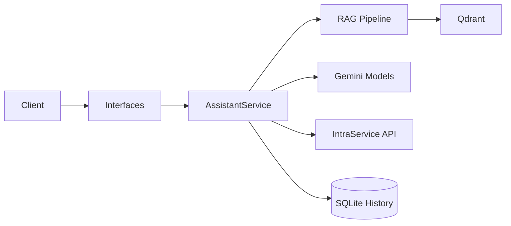

# TEMPO AI Assistant

Корпоративный AI-ассистент на базе RAG (Retrieval-Augmented Generation). Отвечает на вопросы сотрудников по внутренней документации текстом и голосом, интегрируется с Helpdesk (IntraService).

## Технологический стек

| Компонент | Технология |
|-----------|-----------|
| LLM | Google Gemini (`google-genai`) |
| Векторная БД | Qdrant (локально в `qdrant_storage/`) |
| Интерфейсы | Telegram, FastAPI, Desktop (Flet) |
| Поиск | Hybrid Search (Vector + BM25 + RRF), RAG Fusion, LLM Rerank, CRAG, HyDE |
| Голос | Gemini Live API (Native Audio), `pydub`, `static-ffmpeg` |
| История чата | SQLite (`chat_history.db`), автосуммаризация |
| Пакетный менеджер | `uv` (`uv.lock`) |

## Архитектура

```
src/
├── core/        # Конфигурация, клиенты, API-ключи, исключения
├── rag/         # Поисковый пайплайн (чанкинг, эмбеддинги, поиск)
├── llm/         # Обёртки Gemini (текст и Live API)
├── services/    # AssistantService — единая точка входа бизнес-логики
└── interfaces/  # Telegram-бот, HTTP API, Desktop-клиент
```



Все запросы (текст/голос) проходят через **`AssistantService`** (`src/services/assistant.py`):
- `process_text_query` — RAG-цикл: деконтекстуализация → поиск → генерация ответа
- `process_voice_query` — путь через Gemini Live API с Function Calling
- `create_helpdesk_ticket` — создание заявки на основе диалога

## Быстрый старт

### 1. Установка зависимостей

```bash
# Рекомендуется: uv (быстрее, используется в проекте)
uv sync

### 2. Конфигурация

```bash
cp env.example .env
# Заполните TELEGRAM_TOKEN и GEMINI_API_KEY_1 в .env
# Модели и параметры RAG настраиваются в models_config.yaml
```

### 3. Подготовка базы знаний

Положите документы в папку `data/`, затем:

```bash
# Полный цикл: чанкинг + векторизация (рекомендуется)
python scripts/process_documents.py

# Или раздельно:
python scripts/prepare_chunks.py   # Только чанкинг (с кэшированием)
python scripts/update_database.py  # Только векторизация и загрузка в Qdrant

# Инициализация базы (без кэша, первый запуск)
python scripts/init_database.py
```

### 4. Запуск

```bash
# Telegram-бот (только TG)
python run_bot.py
# или
uv run run_tg_bot.py

# MAX-бот (только MAX мессенджер)
uv run run_max_bot.py

# Оба бота (Telegram + MAX) одновременно в одном event loop
uv run run_all_bots.py

# HTTP API сервер
python run_server.py

# Сервер + Telegram бот одновременно
uv run run_server.py --with-bot

# Desktop-клиент (требует запущенный сервер)
python run_client.py
```

## Конфигурация

| Файл | Назначение |
|------|-----------|
| `.env` | API-ключи и секреты (из `env.example`) |
| `models_config.yaml` | Модели (text, audio, embedding) и параметры RAG |
| `qdrant_storage/` | Данные векторной базы |
| `data/` | Исходные документы для индексации |
| `chat_history.db` | SQLite-база истории диалогов |

### Множественные API-ключи

Проект поддерживает автоматический ротационный fallback между ключами Gemini:

```env
GEMINI_API_KEY_1=...
GEMINI_API_KEY_2=...
GEMINI_API_KEY_3=...
```

При исчерпании лимитов одного ключа система автоматически переключается на следующий (`src/core/api_key_manager.py`). Аналогично работает fallback между моделями при 503 (`src/core/model_fallback_manager.py`).

## Документация

| Документ | Описание |
|----------|---------|
| [`docs/INTRASERVICE.md`](docs/INTRASERVICE.md) | Интеграция с Helpdesk: API, создание заявок, авторизация (Kerberos/NTLM) |
| [`docs/VOICE_PROCESSING.md`](docs/VOICE_PROCESSING.md) | Голосовая обработка: режимы Legacy и Function Calling |
| [`docs/SMART_CHUNKER.md`](docs/SMART_CHUNKER.md) | Чанкер документов: кэширование, rate limiting, инкрементальные обновления |
| [`docs/AD_INTEGRATION.md`](docs/AD_INTEGRATION.md) | Интеграция с Active Directory: текущий статус и план |

## Компиляция в EXE (Windows)

Для создания исполняемого файла Desktop-клиента рекомендуется использовать Windows.

### Прямая сборка (рекомендуется)
Используйте встроенную команду `flet build`, которая корректно упаковывает все ресурсы и Flutter-зависимости.

```bash
# Убедитесь, что flet установлен
uv pip install flet

# Сборка Windows-приложения
flet build windows
```
Результат будет в `build/windows`.

### Сборка через PyInstaller (один файл)
Если требуется один `.exe` файл, можно использовать PyInstaller:

```bash
uv run pyinstaller --noconsole --onefile \
  --add-data "assets:assets" \
  --icon "assets/icon.png" \
  --name "TempoAI" \
  run_client.py
```
Файл появится в папке `dist/`.

> [!IMPORTANT]
> При компиляции убедитесь, что в `src/interfaces/desktop_client.py` переменная `DEFAULT_SERVER_URL` указывает на актуальный IP-адрес сервера.