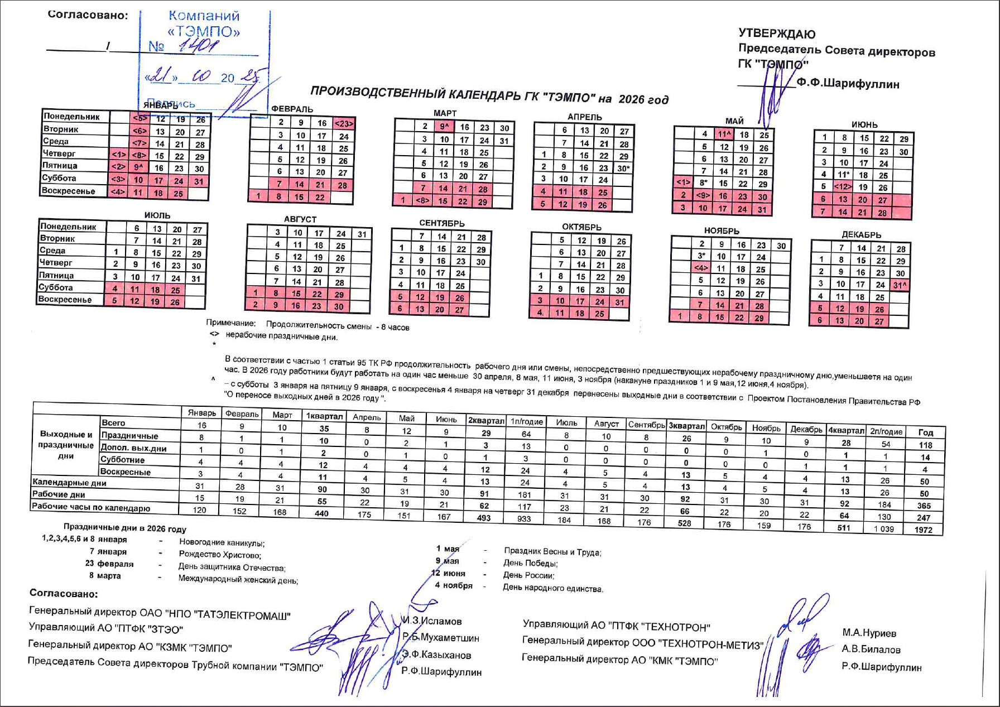

# Производственный календарь ГК «ТЭМПО»

## 📅 Календарь рабочих и выходных дней

Здесь представлен производственный календарь с информацией о:
- **Рабочие дни** - стандартные рабочие дни
- **Выходные дни** - суббота и воскресенье, отмечены в картинке красным цветом
- **Праздничные дни** - государственные праздники, отмечены в картинке красным цветом
- **Сокращенные дни** - дни с сокращенным рабочим днем, отмечены в картинке знаком "*" возле числа

### 📋 Ключевая информация:
- Календарь содержит полный график работы на год
- Показаны все официальные праздники и переносы выходных
- Указаны сокращенные рабочие дни перед праздниками
- Поможет в планировании отпусков и рабочих задач

> **Важно:** При планировании рабочего времени учитывайте официальные праздники и переносы выходных дней согласно производственному календарю.

### 📄 Подробные данные
- **[[Производственный календарь 2026 (текст)|calendar_data_2026]]**: Полный список дат, статистика рабочих часов и примечания по праздникам.

---
*Для получения более подробной информации о графике работы см. также: [[График входа и выхода|03_routine/entry_exit_schedule]]*
